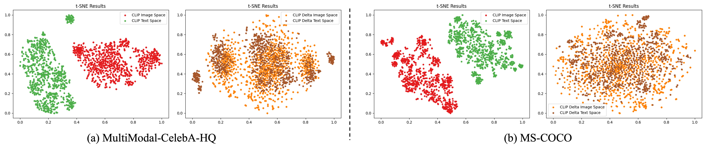
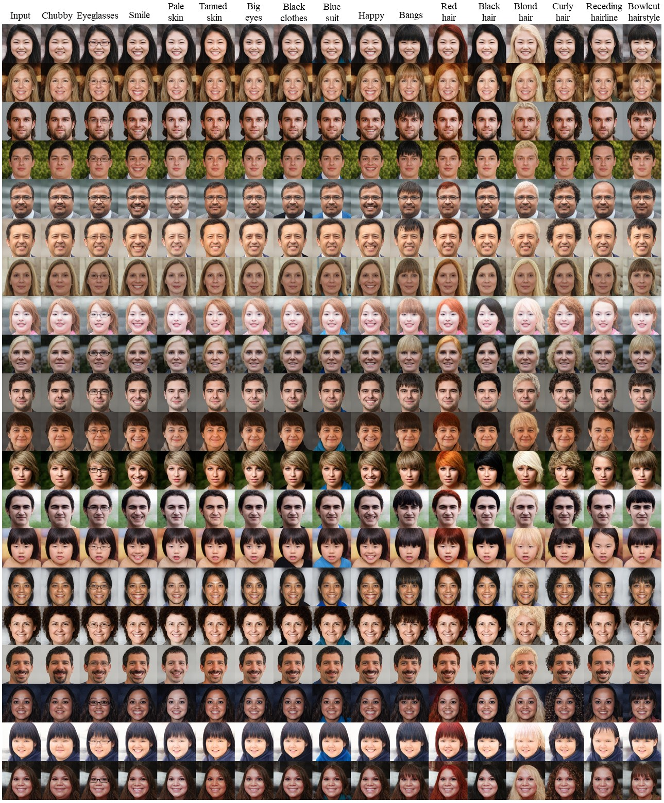

# DeltaSpace: A Semantic-aligned Feature Space for Flexible Text-guided Image Editing

## Overview

This repository contains the **offical** PyTorch implementation of paper:

<!-- *DeltaEdit: Exploring Text-free Training for Text-driven Image Manipulation*, CVPR 2023 -->

*DeltaSpace: A Semantic-aligned Feature Space for Flexible Text-guided Image Editing*, Arxiv 2023

## News

- [2025-06-22] Upload t-SNE Code for Alignment Validation​ (◍＞◡＜◍).

- [2023-03-11] Upload the training and inference code for the facial domain (◍•ڡ•◍).

*To be continued...*

<!-- We will release the training and inference code for the LSUN cat, church, horse later : ) -->

## Dependences

- Install CLIP:

  ```shell script
  conda install --yes -c pytorch pytorch=1.7.1 torchvision cudatoolkit=<CUDA_VERSION>
  pip install ftfy regex tqdm gdown
  pip install git+https://github.com/openai/CLIP.git
  ```

- Download pre-trained models :

  - The code relies on the [Rosinality](https://github.com/rosinality/stylegan2-pytorch/) pytorch implementation of StyleGAN2.
  - Download the pre-trained StyleGAN2 generator model for the faical domain from [here](https://drive.google.com/file/d/1EM87UquaoQmk17Q8d5kYIAHqu0dkYqdT/view?usp=sharing), and then place it into the folder `./models/pretrained_models`.
  - Download the pre-trained StyleGAN2 generator model for the LSUN cat, church, horse domains from [here](https://drive.google.com/drive/folders/1YRhXGM-2xk7A4TExM_jXaNg1f2AiCRlw?usp=share_link) and then place them into the folder `./models/pretrained_models/stylegan2-{cat/church/horse}`.

## Training

### Data preparing

- DeltaEdit is trained on latent vectors. 

- For the facial domain,  58,000 real images from [FFHQ](https://github.com/NVlabs/ffhq-dataset) dataset are randomly selected and 200,000 fake images from the z space in StyleGAN are sampled for training. Note that all real images are inverted by [e4e](https://github.com/omertov/encoder4editing) encoder.

- Download the provided FFHQ latent vectors from [here](https://drive.google.com/drive/folders/13NLq4giSgdcMVkYQIiPj4Xhxz4-wlXSD?usp=sharing) and then place all numpy files into the folder `./latent_code/ffhq`.

- Generate the 200,000 sampled latent vectors by running the following commands for each specific domain:

  ```python
  CUDA_VISIBLE_DEVICES=0 python generate_codes.py --classname ffhq --samples 200000
  CUDA_VISIBLE_DEVICES=0 python generate_codes.py --classname cat --samples 200000
  CUDA_VISIBLE_DEVICES=0 python generate_codes.py --classname church --samples 200000
  CUDA_VISIBLE_DEVICES=0 python generate_codes.py --classname horse --samples 200000
  ```

### Usage

- The main training script is placed in `./scripts/train.py`.
- Training arguments can be found at `./options/train_options.py`. 

For training please run the following commands:

```python
CUDA_VISIBLE_DEVICES=0 python scripts/train.py
```

## Inference

- The main inferece script is placed in `./scripts/inference.py`.
- Inference arguments can be found at `./options/test_options.py`. 
- Download the pretrained DeltaMapper model for editing human face from [here](https://drive.google.com/file/d/1Mb2WiELoVDPDIi24tIfoWsjn1l2xTjtZ/view?usp=sharing), and then place it into the folder `./checkpoints` .
- Some inference data are provided in  `./examples`.

To produce editing results please run the following commands :

```python
CUDA_VISIBLE_DEVICES=1 python scripts/inference.py --target "chubby face","face with eyeglasses","face with smile","face with pale skin","face with tanned skin","face with big eyes","face with black clothes","face with blue suit","happy face","face with bangs","face with red hair","face with black hair","face with blond hair","face with curly hair","face with receding hairline","face with bowlcut hairstyle"
```

The produced results are showed in the following. 

You can also specify your desired target attributes to the flag of `--target`.

## Inference for real images

- The main inferece script is placed in `./scripts/inference_real.py`.
- Inference arguments can be found at `./options/test_options.py`. 
- Download the pretrained DeltaMapper model for editing human face from [here](https://drive.google.com/file/d/1Mb2WiELoVDPDIi24tIfoWsjn1l2xTjtZ/view?usp=sharing), and then place it into the folder `./checkpoints` .
- Download the pretrained e4e encoder e4e_ffhq_encode.pt from [e4e](https://github.com/omertov/encoder4editing).
- One test image is provided in  `./test_imgs`.

To produce editing results please run the following commands :

```python
CUDA_VISIBLE_DEVICES=1 python scripts/inference_real.py --target "chubby face","face with eyeglasses","face with smile","face with pale skin","face with tanned skin","face with big eyes","face with black clothes","face with blue suit","happy face","face with bangs","face with red hair","face with black hair","face with blond hair","face with curly hair","face with receding hairline","face with bowlcut hairstyle"
```

## Alignment Validation: CLIP Space vs. DeltaSpace via t-SNE Visualization​

```python
cd tSNE
python compute_tsne.py
```

After executing the implementation code, you can obtain A 2D t-SNE projection of embeddings from both spaces (e.g., CLIP and DeltaSpace). The results are shown below for your convenience.



## Results



## Acknowledgements

This code is developed based on the code of [orpatashnik/StyleCLIP](https://github.com/orpatashnik/StyleCLIP) by Or Patashnik et al.

## Citation
If you use this code for your research, please cite our paper:
<!-- ```
@InProceedings{lyu2023deltaedit,
    author    = {Lyu, Yueming and Lin, Tianwei and Li, Fu and He, Dongliang and Dong, Jing and Tan, Tieniu},
    title     = {DeltaEdit: Exploring Text-free Training for Text-Driven Image Manipulation},
    booktitle = {Proceedings of the IEEE Conference on Computer Vision and Pattern Recognition (CVPR)},
    year      = {2023},
} -->
```
@article{lyu2023deltaspace,
    author    = {Lyu, Yueming and Zhao, Kang and Peng, Bo and Chen, Huafeng and Jiang, Yue and Zhang, Yingya and Dong, Jing, and Shan Caifeng},
    title     = {DeltaSpace: A Semantic-aligned Feature Space for Flexible Text-guided Image Editing},
    journal   = {arXiv preprint arXiv:2310.08785},
    year      = {2023},
}
```
